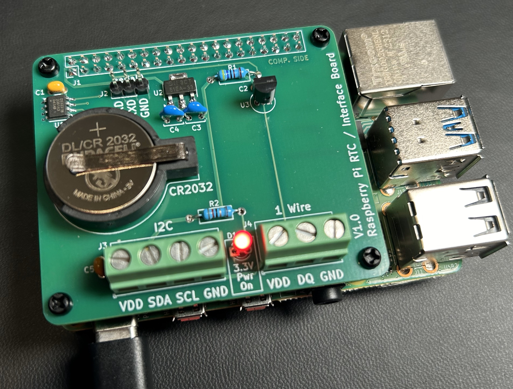
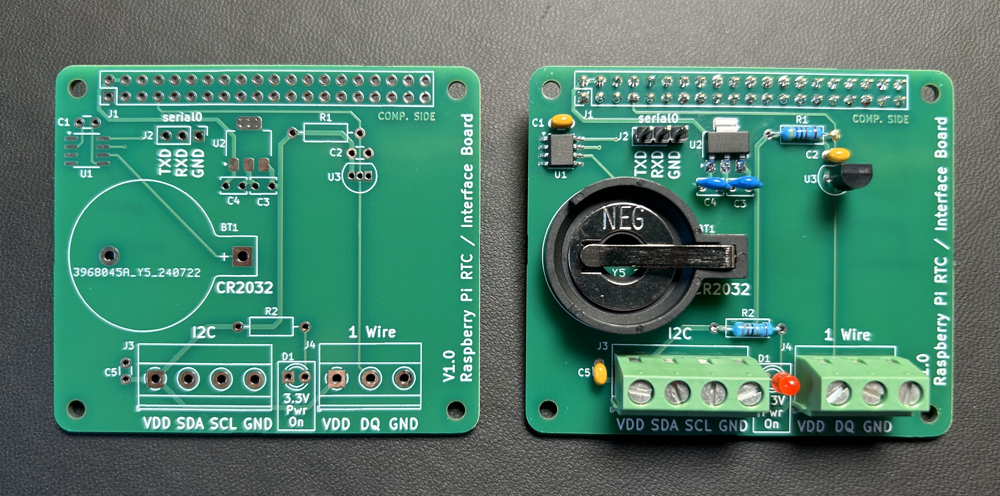
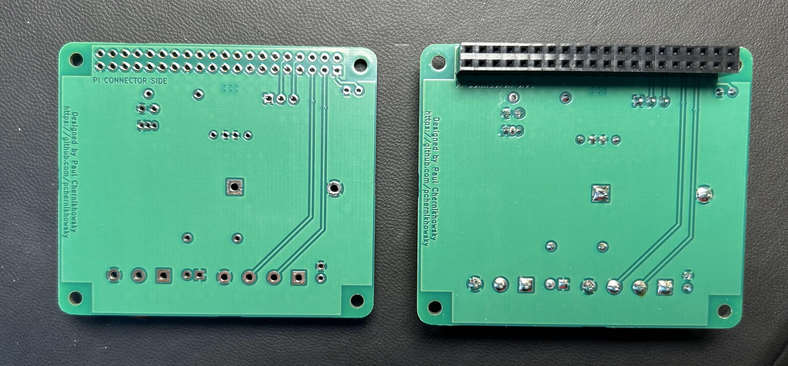

# Raspberry Pi RTC / Interface Board

## Description

A Raspberry Pi HAT-style interface board that includes:
* [DS3231](https://www.analog.com/en/products/ds3231.html) highly accurate real-time clock (RTC) with replaceable battery backup
* [DS18B20](https://www.analog.com/en/products/ds18b20.html) precision temperature sensor
* 3-pin header terminal for access to the serial console (`/dev/ttyS0` a.k.a. `/dev/serial0`) connection
* Screw terminals for connecting [I2C](https://en.wikipedia.org/wiki/I%C2%B2C) devices (such as displays, sensors, D/A and A/D converters, etc.)
* Screw terminals for connecting [1-Wire](https://en.wikipedia.org/wiki/1-Wire) devices (such as additional DS18B20 temperature sensors and other 1-Wire compatible devices)

  

## Hardware
### Electrical Interfaces

Two sets of screw terminals are provided:
1. A four-terminal I2C connector with 3.3V power, SDA, SCL, and ground.
2. A three-terminal 1-Wire connector with 3.3V power, DQ, and ground.

Pull-ups for the SDA, SCL and DQ signals are provided. An LED indicates that 3.3V power is present at the terminals. 

> [!NOTE]
> As per the spec for the [onboard 5V to 3.3V LDO](https://www.diodes.com/assets/Datasheets/AP7361EA.pdf), the I2C and 1-Wire interfaces are able to supply up to 1 amp of power to connected devices. If the 3.3V power output from the I2C or 1-Wire interfaces are overloaded or shorted to ground (i.e., current draw exceeds 1.5 amps), the LDO regulator will automatically shutdown (and the 3.3V power LED will extinguish). Removing the overload/short will automatically restore the 3.3V power supply.

A 3-pin 0.1 in. spacing header connector provides access to the `/dev/ttyS0` serial device signals RXD, TXD and GND.

> [!NOTE]
> * RXD refers to serial data received by (input to) the Pi.
> * TXD refers to serial data sent from (output from) the Pi.

> [!CAUTION]
> **The Raspberry Pi uses non-5V tolerant 3.3V GPIO**. This includes the SDA, SCL, DQ and serial port levels. As such, level shifters are required for EIA232 signal compatibility. Many 3.3V to USB interface cables are available for purchase from Amazon, eBay, etc.

### Hardware Construction and Setup

The PCB is designed to mount on any RaspBerry Pi Model A+/B+ or later (i.e., any Pi with the 40 pin expansion connecter). While the PCB conforms to the Pi HAT [physical specification](https://github.com/raspberrypi/hats/blob/master/hat-board-mechanical.pdf) there is no EEPROM for full autoconfiguration. As such, this project does not claim 100% compatibility with the Pi HAT specification. 

The schematic and PCB layout were designed using [KiCad 8.0](https://www.kicad.org/). A full hardware design including [schematic](schematic.pdf) and [PCB layout](RPi_RTC_Interface_model.jpg) in KiCad format are provided. A Microsoft Excel [bill of materials](RPi_RTC_interface-BOM.xlsx) is also included.

> [!TIP]
> I prefer to order my PCBs from [JLCPCB](https://jlcpcb.com/) and components from [DigiKey](https://digikey.com). The total parts cost (excluding the PCB and CR2032 coin cell) is approximately $24 USD (as of September 2024).

Following are unpopulated and populated photos of the front and rear of the PCB.

  
  

## Updating the Raspberry Pi OS to support the peripherals

1. [Configure the kernel and install the necessary RTC packages.](https://pimylifeup.com/raspberry-pi-rtc/)
2. [Enable the 1-Wire interface.](https://www.circuitbasics.com/raspberry-pi-ds18b20-temperature-sensor-tutorial/)
 
## Version history

* 1.0
    * Initial Release

## License

This project is licensed under the GPL-3.0 License. See the [LICENSE](LICENSE) file for details.

## Acknowledgments

PCB dimensions and layout courtesy:
* [RPi_Hat_Template](https://github.com/devbisme/RPi_Hat_Template)

